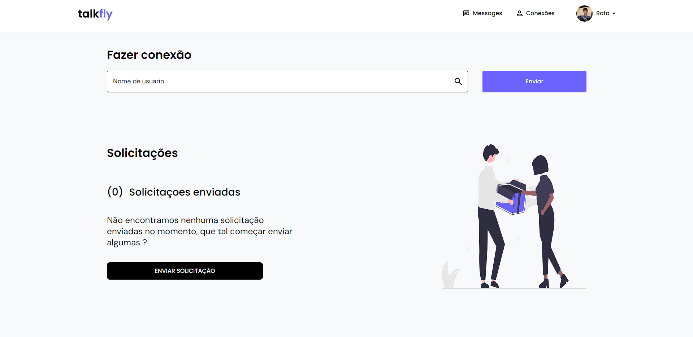
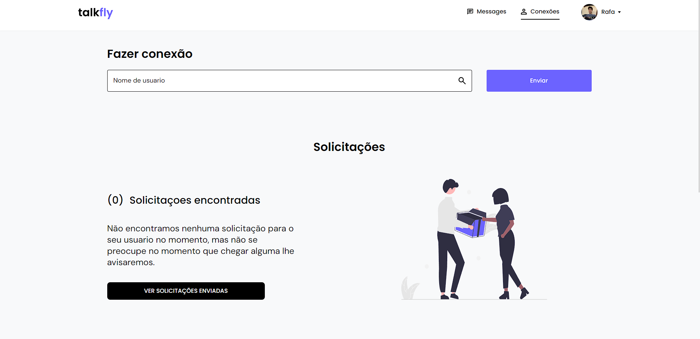

## Talkfly

## Descrição

O Talkfly é uma poderosa aplicação de comunicação em tempo real, com uma interface intuitiva e responsiva desenvolvida em Next.js. Com recursos de autenticação de usuários, gerenciamento de conexões e solicitações, e a capacidade de enviar mensagens, áudio e imagens instantaneamente, o Talkfly proporciona uma experiência de comunicação fluida e eficiente. Além disso, integra-se perfeitamente com a Talkfly-API, ampliando ainda mais suas funcionalidades e possibilitando uma comunicação mais dinâmica e personalizada.

## Recursos Principais

- Comunicação em tempo real.
- Gerenciamento de conexões e solicitações.
- Envio de Arquivos Multimídia: Capacidade de enviar e receber arquivos de áudio e fotos durante as conversas.
- Interface acessiva e responsiva.

## Layout

## 🛠️ Tecnologias

💻 **Front-end**

- [Next](https://nextjs.org/docs)
- [React](https://react.dev/)
- [Typescript](https://www.typescriptlang.org)
- [Vite](https://vitejs.dev/)

📚 **Bibliotecas**

- [clsx](https://github.com/lukeed/clsx)
- [emoji-picker-react](https://www.npmjs.com/package/emoji-picker-react)
- [jose](https://www.npmjs.com/package/jose)

🎨 **Estilização**

- [tailwindcss](https://tailwindcss.com/docs/installation)

  🔋 **Versionamento e Deploy**

- [Git](https://git-scm.com)"

⚙️ **Configuranções e Instalações**

Clone do Projeto

    $ git clone https://github.com/Faelkk/my-portfolio

Instalando as dependências

    $ npm install

Iniciando o projeto

    $ npm run dev

 

**Como me ajudar nesse projeto?**

- Você ira me ajudar muito me seguindo aqui no GitHub
- Dando uma estrela no projeto
- Conectando-se comigo no LinkedIn para fazer parte da minha rede.

 

**Feito por**
[Rafael Achtenberg](linkedin.com/in/rafael-achtenberg-7a4b12284/)
